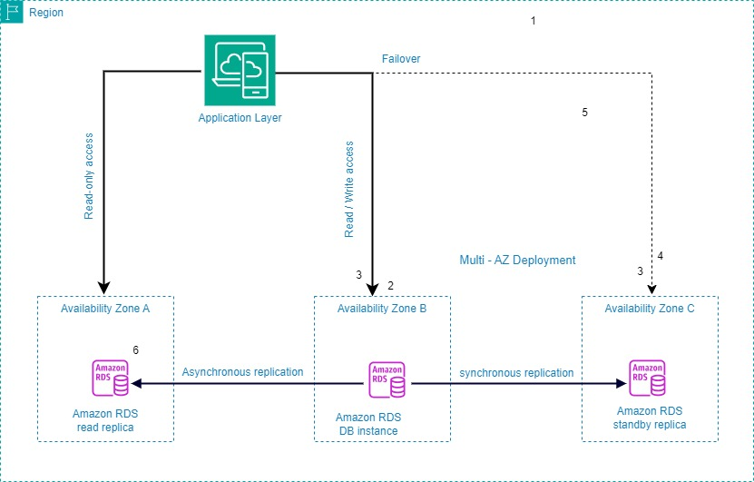

# Amazon RDS Lab Project

## Overview

This project demonstrates the deployment of a highly available, durable, and scalable Amazon RDS (Relational Database Service) instance using Multi-AZ (Availability Zones) and read replicas to improve operational efficiency, availability, and performance.

## Scenario

The organization's Database Administrators have raised concerns about the time spent on operational tasks, such as patching and managing database infrastructure, which detracts from focusing on customer innovation. Additionally, they have faced data loss issues. The Data Analytics team requires real-time queries and big data analytics, but data performance degrades with large read loads. Therefore, a solution is needed to enhance system resilience in case of disaster and improve performance.

## Objectives

1. **Reduce Administrative Workload**: Implement a fully managed database to minimize manual infrastructure provisioning and maintenance.
2. **Ensure Data Protection**: Enable robust data backup solutions to prevent data loss.
3. **Enhance Availability and Durability**: Deploy the database across multiple Availability Zones for high availability.
4. **Improve Performance and Scalability**: Create read replicas to handle read-heavy workloads efficiently.

## Solution

### Step 1: Create an Amazon RDS for MySQL Instance
- Utilize Amazon RDS, which is fully managed, eliminating the need for manual database infrastructure provisioning and maintenance.

### Step 2: Enable Backups to Prevent Data Loss
- Amazon RDS automates backups, database snapshots, and host replacement, reducing the administrative burden and ensuring data protection.

### Step 3: Enable Multi-AZ Deployment for High Availability and Durability
- Deploy the database across multiple Availability Zones (AZ) to achieve high availability. In a multi-AZ deployment, Amazon RDS automatically creates a primary DB instance and synchronously replicates the data to an instance in a different AZ. In case of a failure, Amazon RDS automatically fails over to a standby instance in a different AZ without manual intervention.

### Step 4: Create a Read Replica to Improve Performance and Scalability
- For read-heavy workloads, create one or more read-only replicas of a DB instance. This allows handling high-volume application read traffic from multiple copies of the data, increasing overall throughput and performance.

## Implementation Steps

### Step 1: Review Practice Lab Objectives
1. Start the lab and open the AWS Console.

### Step 2: Create the Database
1. Navigate to RDS in the AWS Console.
2. Choose 'Standard create' for database creation.
3. Select MariaDB as the engine type.
4. Use 'Dev/Test' template and configure instance details with a `db.t3.xlarge` instance class.
5. Enable Multi-AZ deployment.

### Step 3: Configure Database
1. Set up instance identifier, master username, and password.
2. Enable storage autoscaling and review other configurations.
3. Ensure backups and encryption are enabled.
4. Create the database and wait for it to be available.

### Step 4: Create Read Replica
1. Once the primary database is available, create a read replica using a `db.t3.xlarge` instance.

## Reference Diagram

The architecture for the deployed solution can be visualized in the reference diagram:



### Diagram Steps Explanation

1. **Application Layer Access**
   - The application layer accesses the database for both read and write operations in Availability Zone B, and read-only operations in Availability Zone A.

2. **Primary DB Instance**
   - The primary Amazon RDS instance is located in Availability Zone B and handles all read/write operations.

3. **Synchronous Replication**
   - Data is synchronously replicated from the primary DB instance in Availability Zone B to a standby replica in Availability Zone C to ensure high availability and durability.

4. **Standby Replica**
   - The standby replica in Availability Zone C is kept in sync with the primary instance and takes over in case of a failure (failover).

5. **Multi-AZ Deployment**
   - Amazon RDS ensures automatic failover to the standby replica in Availability Zone C if the primary instance fails.

6. **Read Replica**
   - An additional read replica is created in Availability Zone A for read-heavy workloads, allowing the application to distribute read traffic and improve performance.

## Database in Practice

The implementation of the described solution has improved the operational efficiency, availability, and performance of the database by using multiple Availability Zones and a read replica.

## References

- Cloud Quest: Serverless, Amazon Skill Builder. https://explore.skillbuilder.aws/learn/course/external/view/elearning/15623/aws-cloud-quest-serverless-developer

## Scripts

### create-rds-instance.sh

```bash
#!/bin/bash

# This script automates the creation of an Amazon RDS instance
aws rds create-db-instance \
    --db-instance-identifier my-database \
    --allocated-storage 20 \
    --db-instance-class db.t3.xlarge \
    --engine mariadb \
    --master-username admin \
    --master-user-password ILoveLearning!123 \
    --backup-retention-period 7 \
    --multi-az \
    --storage-type gp2 \
    --publicly-accessible \
    --tags Key=Name,Value=my-database
```

---
